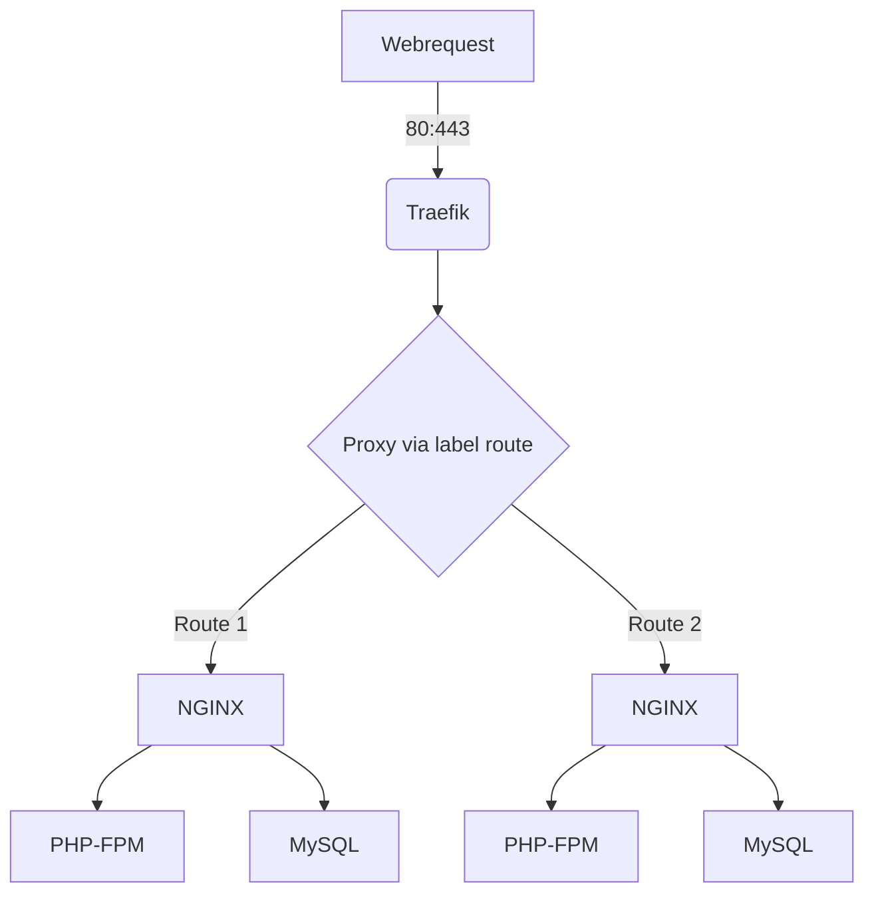

# Project to deploy a fully working local web - environment 

## Diagram:



## Tech included:
* traefik proxy
* NGINX 
* PHP-FPM
* MySQL

## changes regarding usage from plain docker:
* Containers are interconnected within a own network [ NGINX - MySQL - PHPFPM]
* Traefik is exposed to 80:443 and proxys to the containers dynamically 
* Dynamic proxy is used with labels ( see docker-compose.yaml )
* Traefik can deploy SSL certificates from lets encrypt from Production / Staging

## Requirements:
* Windows 10 / 11  + Linux Subsystem for Windows V2
* Docker Engine (Windows + MacOS)
* docker-compose / docker installed in WSL
* docker compose via Homebrew (macOS)

* Settings in Docker Desktop (Windows)
https://docs.docker.com/desktop/windows/wsl/

* MacOS Brew Install Script for Docker-Compose
brew install docker docker-compose

### Usage

* Traefik is needed so start it first.
```
cd traefik
docker-compose up -d
```

Start your Docker Environment:
```
docker-compose up -d 
```

See the environment file for additional settings.

### Extended Configuration
* Labels
```
 - "traefik.enable=true"
Enables discovery for container from traefik without restart of the container

 - "traefik.http.routers.fmtv.rule=Host(`${CUSTOMERNAME}.localdev.pxia.de`)"
Will use Hostname rule to route to the container 

 - "traefik.docker.network=traefik-network"
Designate the network from the traefik container

 - "traefik.http.routers.fmtv.entrypoints=web" 
Entrypoint for HTTP

 - "traefik.http.routers.whoami.entrypoints=websecure"
Entrypoint for HTTPS

 - "traefik.http.routers.whoami.tls.certresolver=myresolver"
Resolver for LE Certificates
```